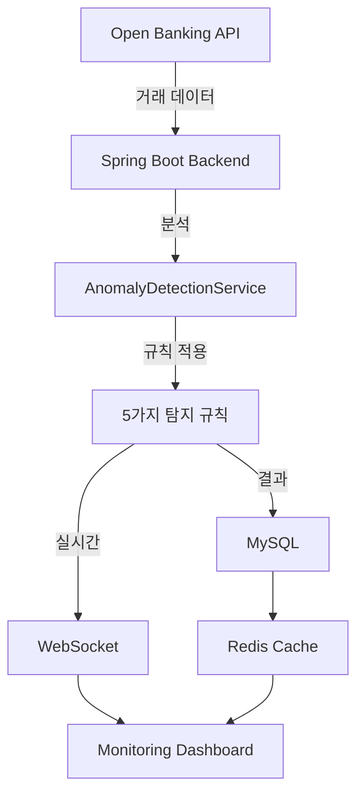

# 시스템 아키텍처

## 1. 전체 시스템 흐름



## 2. 데이터 흐름

| 단계 | 설명 | 기술 |
|------|------|------|
| 1 | 거래 데이터 수신 | Open Banking API |
| 2 | 데이터 검증 | Spring Boot Validation |
| 3 | 이상 거래 판정 | 기술통계, 규칙 기반 |
| 4 | 결과 저장 | MySQL |
| 5 | 실시간 전송 | WebSocket |
| 6 | 시각화 | Dashboard |

## 3. 탐지 프로세스
```
거래 수신
↓
기본 검증
↓
사용자 통계 조회
↓
Rule 1: 거래액 검사
Rule 2: 시간대 검사
Rule 3: 거래처 검사
Rule 4: 빈도 검사
Rule 5: 신규 거래처 검사
↓
규칙 개수 확인
↓
if 규칙 >= 1:
is_abnormal = TRUE
신뢰도 점수 계산
Alert 생성
WebSocket 전송
else:
정상 거래
↓
MySQL에 저장
↓
대시보드 업데이트
```


## 4. 기술 스택

| 계층 | 기술 | 용도 |
|------|------|------|
| API | Spring Boot 2.7 | REST API 제공 |
| 실시간 | WebSocket | 양방향 통신 |
| 데이터베이스 | MySQL | 거래 저장 |
| 캐싱 | Redis | 성능 최적화 |
| 배포 | AWS EC2/RDS | 클라우드 호스팅 |