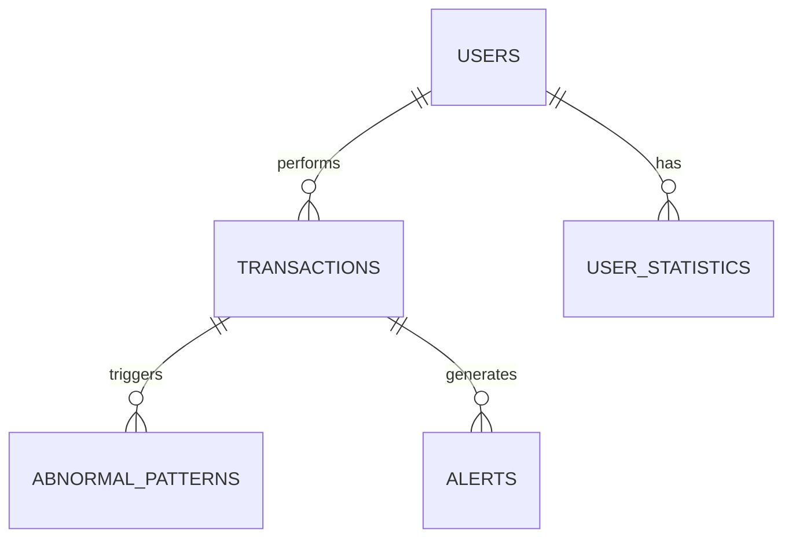

# 데이터베이스 설계

## 1. ER Diagram



## 2. 테이블 정의

### transactions (거래 테이블)

| 컬럼명 | 타입 | 제약조건 | 설명 |
|--------|------|---------|------|
| id | BIGINT | PK | 거래 ID |
| user_id | BIGINT | FK | 사용자 ID |
| amount | DECIMAL(15,2) | NOT NULL | 거래액 |
| transaction_time | TIMESTAMP | NOT NULL | 거래 시간 |
| merchant_id | VARCHAR(50) | | 가맹점 ID |
| merchant_name | VARCHAR(100) | | 가맹점명 |
| category | VARCHAR(50) | | 거래 카테고리 |
| is_abnormal | BOOLEAN | DEFAULT FALSE | 이상 여부 |
| abnormal_reason | VARCHAR(200) | | 이상 사유 |
| created_at | TIMESTAMP | DEFAULT CURRENT_TIMESTAMP | 생성 시간 |

**인덱싱:**
```sql
CREATE INDEX idx_user_time ON transactions(user_id, transaction_time);
CREATE INDEX idx_abnormal ON transactions(is_abnormal);
CREATE INDEX idx_merchant ON transactions(merchant_id);
```

### user_statistics (사용자별 통계)

| 컬럼명 | 타입 | 설명 |
|--------|------|------|
| user_id | BIGINT | 사용자 ID (PK) |
| avg_amount | DECIMAL(15,2) | 평균 거래액 |
| std_amount | DECIMAL(15,2) | 표준편차 |
| avg_transactions_per_day | INT | 일일 평균 거래 건수 |
| last_updated | TIMESTAMP | 마지막 업데이트 |

### abnormal_patterns (이상 패턴)

| 컬럼명 | 타입 | 설명 |
|--------|------|------|
| id | BIGINT | ID (PK) |
| transaction_id | BIGINT | 거래 ID (FK) |
| pattern_type | VARCHAR(50) | HIGH_AMOUNT, ODD_TIME, ... |
| confidence_score | FLOAT | 신뢰도 (0~1) |
| detected_at | TIMESTAMP | 탐지 시간 |

### alerts (알림)

| 컬럼명 | 타입 | 설명 |
|--------|------|------|
| id | BIGINT | ID (PK) |
| transaction_id | BIGINT | 거래 ID (FK) |
| alert_level | VARCHAR(20) | INFO, WARNING, CRITICAL |
| message | VARCHAR(500) | 알림 메시지 |
| is_resolved | BOOLEAN | 해결 여부 |
| created_at | TIMESTAMP | 생성 시간 |

## 3. 생성 SQL

```
CREATE TABLE transactions (
id BIGINT PRIMARY KEY AUTO_INCREMENT,
user_id BIGINT NOT NULL,
amount DECIMAL(15, 2) NOT NULL,
transaction_time TIMESTAMP NOT NULL,
merchant_id VARCHAR(50),
merchant_name VARCHAR(100),
category VARCHAR(50),
is_abnormal BOOLEAN DEFAULT FALSE,
abnormal_reason VARCHAR(200),
created_at TIMESTAMP DEFAULT CURRENT_TIMESTAMP,
INDEX idx_user_time (user_id, transaction_time),
INDEX idx_abnormal (is_abnormal)
);

CREATE TABLE user_statistics (
user_id BIGINT PRIMARY KEY,
avg_amount DECIMAL(15, 2),
std_amount DECIMAL(15, 2),
avg_transactions_per_day INT,
last_updated TIMESTAMP
);

CREATE TABLE abnormal_patterns (
id BIGINT PRIMARY KEY AUTO_INCREMENT,
transaction_id BIGINT NOT NULL,
pattern_type VARCHAR(50),
confidence_score FLOAT,
detected_at TIMESTAMP,
FOREIGN KEY (transaction_id) REFERENCES transactions(id)
);

CREATE TABLE alerts (
id BIGINT PRIMARY KEY AUTO_INCREMENT,
transaction_id BIGINT NOT NULL,
alert_level VARCHAR(20),
message VARCHAR(500),
is_resolved BOOLEAN DEFAULT FALSE,
created_at TIMESTAMP DEFAULT CURRENT_TIMESTAMP,
FOREIGN KEY (transaction_id) REFERENCES transactions(id)
);
```